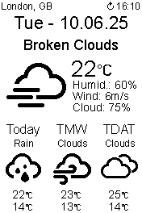

# ProtoStax_Weather_Station_Demo

Demo for ProtoStax Weather Station with ePaper Display and Raspberry Pi


using [ProtoStax for Raspberry Pi B+](https://www.protostax.com/products/protostax-for-raspberry-pi-b)

Screenshot:



## Prerequisites

* Enable SPI on the Raspberry Pi
* API Key from OpenWeatherMap  -  [https://openweathermap.org/api](https://openweathermap.org/api)
* OpenWeatherMap One Call API 3.0 subscription (Base plan is sufficient) - [https://home.openweathermap.org/subscriptions](https://home.openweathermap.org/subscriptions)
* Geo coords for your location – Find them here: [https://openweathermap.org/find](https://openweathermap.org/find)
* Python 3 or higher (Python 3.11 is included with Raspberry Pi OS 'Bookworm')

**Install Spidev, RPi.GPIO and Pillow:**

```bash
sudo apt-get install python3-spidev
sudo apt-get install python3-rpi.gpio
sudo apt-get install python3-pil
```

## Installation

This demo uses the PyOWM library -
[https://github.com/csparpa/pyowm](https://github.com/csparpa/pyowm)

It also uses Waveshare's ePaper library -
[https://github.com/waveshareteam/e-Paper](https://github.com/waveshareteam/e-Paper)

### Install PyOWM Library

*Note: The pip version of PyOWM is outdated. Use the GitHub version for full support of the latest OpenWeatherMap One Call API 3.0.*

```bash
sudo pip install pyowm --break-system-packages

cd ~
git clone https://github.com/csparpa/pyowm

cd /usr/local/lib/python3.11/dist-packages/pyowm/

sudo rm -rf /usr/local/lib/python3.11/dist-packages/pyowm/*
sudo cp -rf ~/pyowm/pyowm/* ./
```

### Install Waveshare e-Paper Library

```bash
cd ~
git clone https://github.com/waveshareteam/e-Paper
cd ~/e-Paper/RaspberryPi_JetsonNano/python
sudo python setup.py install
```

### Clone this Repository

```bash
cd ~
git clone https://github.com/AerospaceDoe/ProtoStax_Weather_Station_Demo
```

## Usage

```bash
cd ~/ProtoStax_Weather_Station_Demo
```

Edit main.py to:

* Insert your OpenWeatherMap API key
* Set the location name and the geo coords

Run it once to test:

```bash
sudo python main.py
```

## Autorun Setup

Edit launcher.sh and ensure the file path inside launcher.sh is correct:

```bash
nano ~/ProtoStax_Weather_Station_Demo/launcher.sh
```

Add Cron Jobs:

Open the crontab file:

```bash
sudo nano /etc/crontab
```

Add the following lines to the end of crontab:

* Sync system time at boot and every hour at :30
* Fetch weather data and update the ePaper display at 5, 15, 25, 35, 45, and 55 minutes past each hour

```cron
@reboot   root    sleep 60 && date -s "$(wget -qSO- --max-redirect=0 google.com 2>&1 | grep Date: | cut -d' ' -f5-8)Z"

30 *    * * *    root   date -s "$(wget -qSO- --max-redirect=0 google.com 2>&1 | grep Date: | cut -d' ' -f5-8)Z"

5 *    * * *    root   sh /home/pi/ProtoStax_Weather_Station_Demo/launcher.sh  > /dev/null 2>&1
15 *    * * *    root   sh /home/pi/ProtoStax_Weather_Station_Demo/launcher.sh  > /dev/null 2>&1
25 *    * * *    root   sh /home/pi/ProtoStax_Weather_Station_Demo/launcher.sh  > /dev/null 2>&1
35 *    * * *    root   sh /home/pi/ProtoStax_Weather_Station_Demo/launcher.sh  > /dev/null 2>&1
45 *    * * *    root   sh /home/pi/ProtoStax_Weather_Station_Demo/launcher.sh  > /dev/null 2>&1
55 *    * * *    root   sh /home/pi/ProtoStax_Weather_Station_Demo/launcher.sh  > /dev/null 2>&1
```

Enable Cron:

```bash
sudo chmod 644 /etc/crontab
sudo systemctl enable cron
```

## License

Written by Sridhar Rajagopal for ProtoStax. BSD license, all text above must be included in any redistribution.

Modified by AerospaceDoe.

A lot of time and effort has gone into providing this and other code. Please support ProtoStax by purchasing products from us!
Also uses the Waveshare ePaper library. Please support Waveshare by purchasing products from them!
